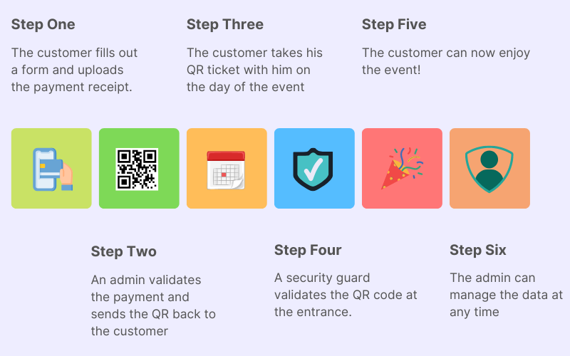
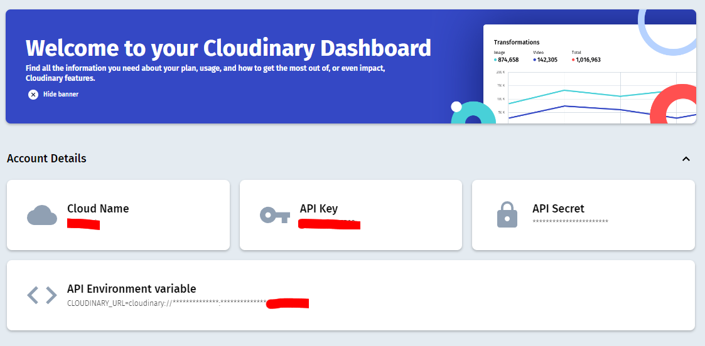

# Event QR ticket management system &middot; [](https://travis-ci.org/npm/npm) [](https://www.npmjs.com/package/npm) [](http://makeapullrequest.com) [](https://github.com/your/your-project/blob/master/LICENSE)

## Description

This administration system allows you to manage the information about your events, salespersons and clients (CRUD). Also, you can create a unique link for each salesperson to sell tickets and generate a secure QR ticket for each client (npm <a href="https://www.npmjs.com/package/crypto-js">crypto</a> and <a href="https://www.npmjs.com/package/qrcode">qrcode</a>). I applied the <a href="https://www.geeksforgeeks.org/what-is-pern-stack/">PERN</a> stack to carry out this project, creating a rest API with Nodejs-Express and a client with Reactjs. I chose these technologies to meet the requirements and apply a relational database with PostgreSQL. Finally, I use <a href="https://cloudinary.com/">Cloudinary</a> to store payment receipts in the cloud.

## Live demo

### Link: <a href="https://qr-tms.herokuapp.com">https://qr-tms.herokuapp.com</a>

#### login as user admin<br>
username: admin<br>
password: 12345<br>
#### login as user security guard <br>
username: security <br>
password: 12345<br>

## Project main process



> This image describes the process of a customer going to an event.

## Getting Started


### Built With

- node: 16.15.0
- npm: 8.5.5
- express: 4.18.1
- react: 18.2.0
- pg: 8.7.3

### Prerequisites

1. Download and install <a href="https://nodejs.org/en/download/">Node.js</a>
2. Download and install <a href="https://www.postgresql.org/download/">PostgreSQL</a> 
3. Download and install <a href="https://www.postman.com/downloads//">Postman</a>


### Installation

First clone the repository with the following commands:

```shell
git clone https://github.com/parduccinward/qr-ticket-management-system.git
cd qr-ticket-management-system/
code .
```

Then start the application by installing npm on both the project root folder and the frontend folder, using the following commands:

#### Backend Start

```shell
npm i
npm run dev
```
The node server.js should start listening on port 4000.
#### Frontend Start

```shell
npm i
npm start
```
The client should start in the browser at port 3000.

### Database Creation

Depending on the operating system you are using, follow the following guidelines to enter PostgreSQL:

- <a href="https://www.microfocus.com/documentation/idol/IDOL_12_0/MediaServer/Guides/html/English/Content/Getting_Started/Configure/_TRN_Set_up_PostgreSQL.htm">Windows Guide</a>
- <a href="https://www.w3resource.com/PostgreSQL/connect-to-postgresql-database.php">Linux Guide</a>

Once inside the psql command line, we create the database by executing the **create-database.sql** file contained in the models folder. Again, this is done depending on the operating system as follows:

Linux
```console

postgres=# \i /yourpath/qr-ticket-management-system/models/create-database.sql

```

Windows
```console

postgres=# \i 'C:/yourpath/qr-ticket-management-system/models/create-database.sql'

```

After running this command, you should get this response:

```console

CREATE DATABASE
You are now connected to database "ticketmanagement" as user "youruser"
CREATE TABLE
CREATE TABLE
CREATE TABLE
CREATE TABLE

```

To check that all the tables were created correctly we can use the command \dt

### User Creation

To create different users, use Postman to consume the **/api/auth/register** API endpoint, sending a JSON body:


#### Create admin user
Admin users can be created with the role 5150.
```json
{
    "username": "admin",
    "password": "12345",
    "role": "5150"
}
```
#### Create security guard user
Security guards users can be created with the role 2001.
```json
{
    "username": "security",
    "password": "12345",
    "role": "2001"
}
```

Make sure to momentarily disable the verify JWT middleware while creating users, in **./routes/users.js** as follows:

```js
// from this
router.post("/register", verifyJWT, registerUser);

// to this
router.post("/register", registerUser);
```

### Create Cloudinary account and get keys

In order for customers to securely upload their payment receipts, we use Cloudinary as a cloud repository. I highly recommend this approach because is free and secure.

Create an account on the official Cloudinary <a href="https://cloudinary.com/users/register/free">registration</a> page. Then go to your dashboard and copy the following credentials:

- Cloud Name
- API Key
- API Secret




### Create environment variables

To complete the installation, we need to create an .env file in the root directory and enter the following credentials:

```env
FRONTEND_ORIGIN="http://localhost:3000"
PORT=4000

PGHOST="localhost"
PGUSER=postgres
PGDATABASE=ticketmanagement
PGPASSWORD=*yourpostgrespwd
PGPORT=5432

ACCESS_TOKEN_SECRET=*youraccesstoken
REFRESH_TOKEN_SECRET=*yourrefreshtoken

CLOUDINARY_CLOUD_NAME=*yourcloudname
CLOUDINARY_API_KEY=*yourcloudinaryapikey
CLOUDINARY_API_SECRET=*yourcloudinaryapisecret
```

- The PG variables are the credentials you have in the PostgreSQL installation.
- The Cloudinary variables are the ones we copied in the previous step.
- Tokens are created using the following code one at a time for each token.

We enter node by typing **node** in a terminal an then:
```
require("crypto").randomBytes(64).toString("hex");
```

## Database

The following image corresponds to the entity relationship model of the project:


## ToDo List

- [x] Create secure QRs
- [x] Auth using JWT
- [x] Create private routes
- [ ] Responsive design
- [ ] Validate fields on backend
- [ ] Show number of clients for each Salesperson

## Licensing

This project uses the MIT license, please see the LICENSE file for more information.

## Acknowledgements

- <a href="https://github.com/gitdagray/react_login_form">Authentication, Axios and Accessibility - Dave Gray</a>
- <a href="https://github.com/gitdagray/mongo_async_crud">NodeJS Tutorial Series - Dave Gray</a>
- <a href="https://github.com/ousecTic/pern-todo-app">PERN Stack - Stoic Programmer</a>
- <a href="https://github.com/iamshaunjp/MERN-Stack-Tutorial">MERN Stack - Net Ninja</a>
- <a href="https://github.com/briancodex/react-sidebar-v1">React Sidebar - Briancodex</a>